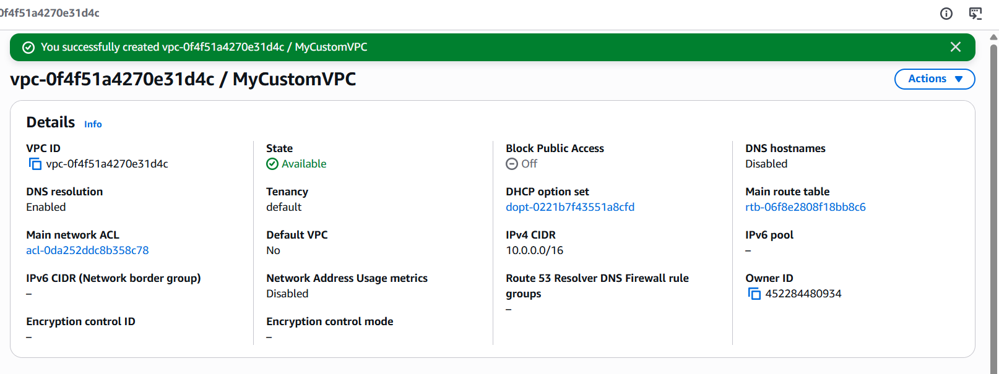
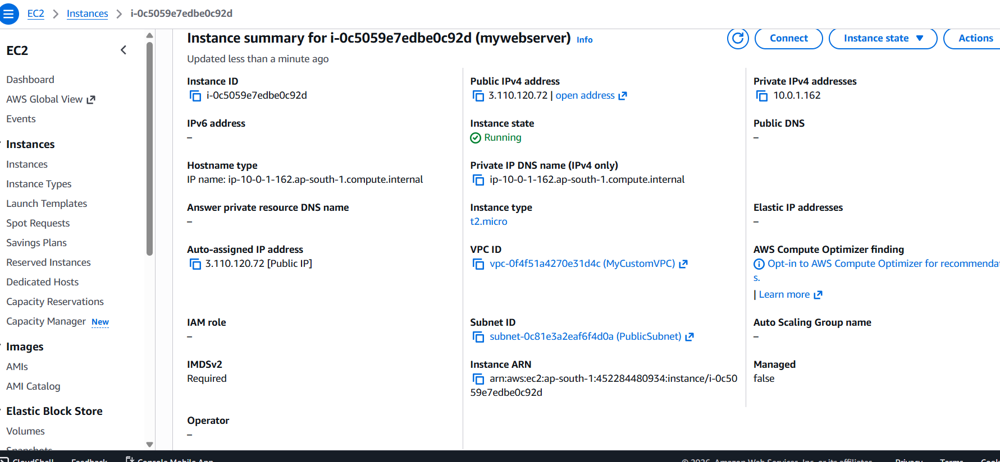
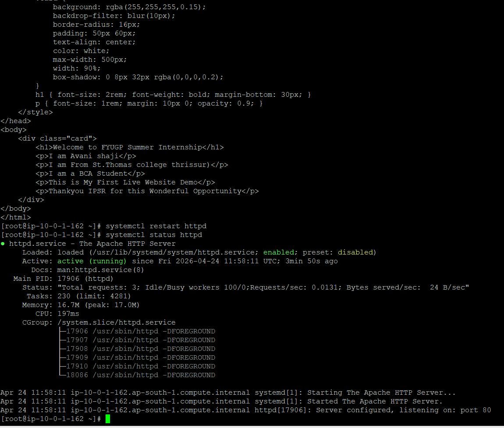

# aws-web-server-project
AWS EC2 Web Server Deployment using Custom VPC

# 🚀 AWS EC2 Web Server Deployment using Custom VPC

## 📌 Project Overview

This project demonstrates the end-to-end deployment of a web server on the AWS cloud using a custom Virtual Private Cloud (VPC). The objective was to create a secure and scalable environment, launch a Red Hat Enterprise Linux EC2 instance, configure a web server, and host a static HTML webpage accessible via a public IP address.

---

## 🧠 Objectives

* Understand AWS networking components (VPC, Subnet, Internet Gateway)
* Launch and configure an EC2 instance
* Install and manage Apache Web Server (httpd)
* Deploy and access a static website
* Apply basic security practices

---

## 🏗️ Architecture Overview

The following components were created and configured:

* **Custom VPC** with CIDR block `10.0.0.0/16`
* **Public Subnet** with CIDR block `10.0.1.0/24`
* **Internet Gateway (IGW)** attached to the VPC
* **Route Table** configured with route `0.0.0.0/0 → IGW`
* **Security Group** with controlled access rules
* **EC2 Instance** running Red Hat Enterprise Linux

---

## ☁️ AWS Services Used

* Amazon EC2
* Amazon VPC
* Security Groups (Firewall)
* Internet Gateway
* Route Tables

---

## 🖥️ Instance Configuration

* **Operating System:** Red Hat Enterprise Linux 9
* **Instance Type:** t2.micro
* **Region:** ap-south-1 (Mumbai)
* **Public IP:** Enabled
* **Key Pair:** Used for secure SSH access
  

---

## 🔐 Security Configuration

* SSH (Port 22) restricted to **My IP** for secure remote access
* HTTP (Port 80) allowed from **anywhere (0.0.0.0/0)** to serve web traffic
* Minimal ports opened to reduce attack surface

---

## ⚙️ Server Setup (Commands Used)

After connecting to the EC2 instance via SSH:

```bash
# Switch to root user
sudo -i

# Install Apache Web Server
yum install -y httpd

# Start Apache service
systemctl start httpd

# Enable Apache on boot
systemctl enable httpd

# Check status
systemctl status httpd
```



---

## 🌐 Web Page Deployment

The default web directory `/var/www/html/` was used.

```bash
# Navigate to web directory
cd /var/www/html

# Create HTML file
vim index.html
```

HTML content was added and saved using Vim editor.

Finally, the server was restarted:

```bash
systemctl restart httpd
```

---

## 💻 Sample HTML Code

```html
<!DOCTYPE html>
<html>
<head>
    <title>AWS Web Server</title>
</head>
<body style="text-align:center; font-family:Arial; background-color:#0072ff; color:white;">
    <h1>Welcome to My AWS Web Server 🚀</h1>
    <p>This website is hosted on EC2 using RHEL</p>
</body>
</html>
```

---

## 🌍 Output

The web page was successfully hosted and accessed through a browser using the EC2 instance’s public IP address.


---

## 💡 Key Learnings

* Hands-on experience with AWS infrastructure setup
* Understanding of cloud networking fundamentals
* Practical exposure to Linux server management
* Deployment of a live web application
* Importance of security configurations in cloud

---

## 🧹 Cost Management

The EC2 instance was **terminated after completion** to avoid unnecessary charges. This ensured efficient use of AWS Free Tier and credits.

---

## 📌 Conclusion

This project demonstrates the fundamental workflow of deploying a web server in a cloud environment. It highlights the integration of networking, compute, and security components within AWS to deliver a working web application.

---

## 🔗 Future Improvements

* Add domain name using Route 53
* Implement HTTPS using SSL/TLS
* Deploy dynamic web applications
* Use load balancers for scalability

---

⭐ This project is part of my cloud computing learning journey and demonstrates foundational AWS deployment skills.

